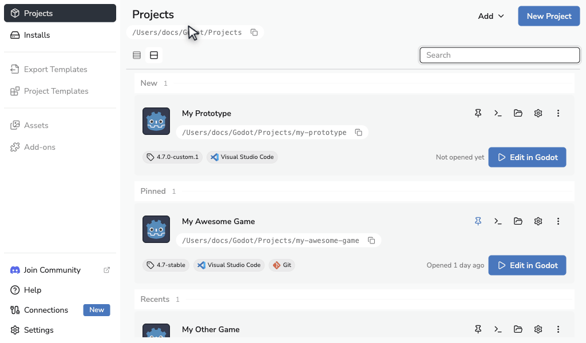

# Godot Launcher

Godot Launcher is a free, open-source desktop app for managing Godot versions and projects on Windows, macOS and Linux. It keeps Godot editor settings separate for each project and helps you set up Git and a code editor.

<a id="how-to-get-godot-launcher"></a>
<a id="documentation"></a>

[Download](https://godotlauncher.org/download) | [Documentation](https://docs.godotlauncher.org) | [Release notes](https://github.com/godotlauncher/launcher/releases)

<picture>
  <source media="(prefers-color-scheme: dark)" srcset="docs/animations/create-project/create-project-anim_dark.gif">
  <source media="(prefers-color-scheme: light)" srcset="docs/animations/create-project/create-project-anim_light.gif">
  
</picture>

## Features

<a id="quick-project-setup-with-git-and-code-editors"></a>
<a id="project-setup-with-git-and-code-editors"></a>
<a id="effortless-godot-version-management"></a>
<a id="godot-version-management"></a>
<a id="custom-editor-support"></a>
<a id="per-project-editor-settings"></a>
<a id="quick-edit-from-system-tray"></a>
<a id="automatic-updates"></a>
<a id="cross-platform-availability"></a>

- **Godot versions and custom builds.** Install stable or pre-release versions, register custom builds, and choose an editor for each project. Generate custom editor manifests in the app. Godot Launcher focuses on Godot 4.0 and later.
- **GitHub projects.** Connect GitHub to browse and import repositories you can access, including private repositories. Publish a new project to a private GitHub repository during creation, or clone a public HTTPS Git repository without connecting an account.
- **Git setup.** Initialise a repository with an optional initial commit and Git LFS configuration. Manage your Git identity and save a separate identity preset for new projects.
- **Code editors.** Configure Visual Studio Code or VSCodium as your default or choose one per project, while preserving unrelated settings. See [Code Editor Settings](https://docs.godotlauncher.org/settings/code-editors/).
- **Per-project settings.** Keep separate Godot editor preferences for each project. Import and export settings to reuse them or share them with teammates.
- **Project access.** Switch between Cards and a compact List view, pin and reorder projects, and open a project's folder in a supported terminal. Open recent projects from the system tray where available.
- **Launcher updates.** Check for new releases and receive update notifications. Download an update, then restart to install it.

<a id="community"></a>

## Support

For questions and discussion, join the [Godot Launcher Discord server](https://discord.gg/Ju9jkFJGvz). For bugs and feature requests, check the [open issues](https://github.com/godotlauncher/launcher/issues) and [closed issues](https://github.com/godotlauncher/launcher/issues?q=is%3Aissue%20state%3Aclosed) before opening a new report.

Report security vulnerabilities through the [security policy](SECURITY.md).

<a id="versioning"></a>

Releases follow [Semantic Versioning](https://semver.org/), with suffixes such as `-beta.1` for pre-release builds. The [changelog](CHANGELOG.md) records changes between releases.

## Contributing

See the [contribution guide](CONTRIBUTING.md) for pull request guidance, the [translation guide](CONTRIBUTING_TRANSLATIONS.md) to help with languages, or the [documentation repository](https://github.com/godotlauncher/launcher-docs) to improve the docs.

AI-assisted contributions are welcome. Contributors remain responsible for understanding, reviewing and testing everything they submit. See the [AI-Assisted Contributions Policy](AI_POLICY.md) for the full requirements.

<a id="feature-proposals"></a>

For a major change or new feature, [open a feature request](https://github.com/godotlauncher/launcher/issues/new?template=feature_request.yaml) to discuss the proposal before starting work.

### Local Development

Fork and clone this repository. Install Node.js **24.15.0 or later** and the npm version declared in [package.json](package.json), then run these commands from the cloned directory:

```sh
npm ci
npm run dev
```

This starts the Electron app. See the contribution guide for [dependency and lockfile guidance](CONTRIBUTING.md#local-development-and-dependencies) and [testing instructions](CONTRIBUTING.md#testing-your-changes).

<a id="free-and-open-source"></a>

## License

Godot Launcher is released under the [MIT License](LICENSE.txt). Third-party assets and libraries have their own licence terms; see [COPYRIGHT.txt](COPYRIGHT.txt).

## Code Signing Policy

Windows releases are signed through SignPath. Free code signing is provided by [SignPath.io](https://signpath.io/), with a certificate from the [SignPath Foundation](https://signpath.org/).

macOS builds are signed with a Developer ID Application certificate issued to Mario DEBONO and notarised by Apple.
